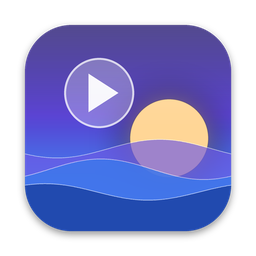

  

<h1 align="center">AeroWall</h1>

  
   
  macOS 14 Sonoma or newer · Apple Silicon & Intel · <a href="https://github.com/johnkhasan/macwall/releases">All releases</a>

AeroWall is a native macOS live wallpaper application built with Swift and AppKit. It allows you to play local video files directly on your desktop background, supporting multiple monitors, smart pausing for battery/performance, and customizable playlists.

## Features
- **Native & Lightweight:** Swift, AppKit and AVFoundation. Videos are optimized to HEVC on import for hardware decoding on Apple Silicon.
- **Multi-Monitor:** One video on every display (decoded once), or a different wallpaper per display. Displays are remembered across reconnects.
- **Smart Pause:** Pauses when the desktop is covered, the screen is locked or asleep, on battery, in Low Power Mode, or when the Mac runs hot. Never keeps the display awake.
- **Playlists:** Rotate videos on a schedule with smooth crossfades, in order or shuffled.
- **Day & Night:** Separate wallpapers for Light and Dark Mode.
- **Overlay Effects:** Rain, snow and fireflies that move away from your pointer, plus Live Weather (Open-Meteo) and parallax.
- **Lock Screen:** A still frame of the wallpaper is set as the desktop picture, so the lock screen and Mission Control match.

## Installation
Since AeroWall manipulates the desktop window level, it cannot be distributed via the Mac App Store.

1. **[Download AeroWall.dmg](https://github.com/johnkhasan/macwall/releases/latest/download/AeroWall.dmg)** (always the latest version).
2. Open the DMG and drag `AeroWall` onto the `Applications` folder.
3. Open AeroWall from Applications. It lives in the menu bar (look for the ▶︎ TV icon).

### Note on Gatekeeper
If you see an "App cannot be opened" warning (Gatekeeper), do the following:
- Go to **System Settings > Privacy & Security** and click **Open Anyway**.
- Alternatively, run this in Terminal: `xattr -dr com.apple.quarantine /Applications/AeroWall.app`

## Usage
Click the **Play** icon (`play.tv`) in the macOS Menu Bar to open settings. 
Drag and drop `.mp4`, `.mov` or `.m4v` videos (or a folder) into the Library. Right-click a video to add it to the playlist, use it for Light/Dark Mode, or put it on a specific display.

*Sample videos can be downloaded from free stock sites like [Pexels](https://www.pexels.com/videos/) or [Coverr](https://coverr.co/).*

## Development
The Xcode project is generated with [XcodeGen](https://github.com/yonaskolb/XcodeGen): run `xcodegen generate` after adding files.

To build a release installer run `scripts/make-dmg.sh`. It produces `dist/AeroWall-<version>.dmg` with the classic drag-to-Applications window. The app icon is drawn by `scripts/generate_icon.py`.

See [CLAUDE.md](CLAUDE.md) for architectural guidelines and rules for AI generation.
